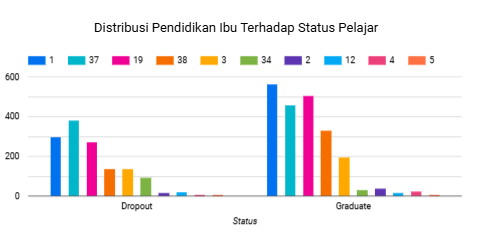
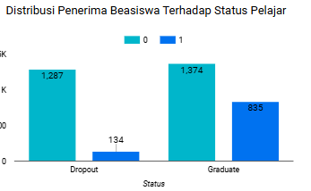
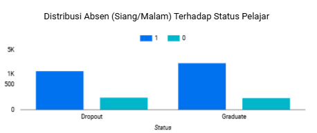
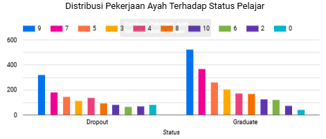

# Proyek Akhir: Penyelesaikan Permasalahan Institusi Pendidikan

## Business Understanding

Jaya Jaya Institut merupakan salah satu institusi pendidikan perguruan yang telah berdiri sejak tahun 2000. Hingga saat ini ia telah mencetak banyak lulusan dengan reputasi yang sangat baik. Akan tetapi, terdapat banyak juga siswa yang tidak menyelesaikan pendidikannya alias dropout.

Jumlah dropout yang tinggi ini tentunya menjadi salah satu masalah yang besar untuk sebuah institusi pendidikan. Oleh karena itu, Jaya Jaya Institut ingin mendeteksi secepat mungkin siswa yang mungkin akan melakukan dropout sehingga dapat diberi bimbingan khusus.

### Permasalahan Bisnis

Oleh karena itu terdapat beberapa pertanyaan yang ingin dijawab based on data yaitu
1. Hal apa saja yang dapat dijadikan sebuah landasan instruktur untuk menggerakkan motivasi pelajar?
2. Variabel (features) apa saja yang berpengaruh secara signifikan terhadap status pelajar?
3. Bagaimana performa model machine learning untuk memprediksi?

### Cakupan Proyek

Proses ini akan melewati tahapan-tahapan sebagai berikut
1. Data Understanding yang memiliki tahapan
   * EDA
     * Distribusi Data Numerik
       * Secara Kontinus
       * Secara Diskrit
     * Distribusi Kategorik
     * Pearson Correlation
2. Data Preparation yang memiliki tahapan
   * Normalisasi : Untuk normalisasi sendiri akan menguji penggabungan jenis 2 metode yaitu untuk data yang bersifat kontinus akan memanfaatkan z-score dan yang bersifat diskrit akan memanfaatkan min-max
   * Label Encoder
   * Feature Selection LASSO
   * Split Data
   * SMOTE
3. Modeling dengan model machine learning dengan jenis klasifikasi yaitu SVM kernel RBF dengan sifat binary class
4. Evaluasi yang digunakan adalah Confusion Matrix dengan jenis parameter Akurasi, Presisi, recall, dan F1-Score

### Persiapan

Sumber data: data.csv (https://archive.ics.uci.edu/dataset/697/predict+students+dropout+and+academic+success)

Setup environment:

```
conda create --name students_dropout python=3.9
conda activate students_dropout
```

```
pip install requirements.txt
```

## Business Dashboard

https://lookerstudio.google.com/reporting/d538ecfc-2c73-4727-94d9-5cd013759688

1.  Hubungan pendidikan Ibu terhadap Status Pelajar

   

Hubungan pendidikan Ibu pada status pelajar dropout yang tertinggi adalah lulusan SD kelas 5 (37) dan tinggi kedua adalah pendidikan paket kelas (1). Hal itu berbanding terbalik oleh status pelajar graduate yang bisa diindikasikan bahwasanya memang tidak ada hubungan antara Pendidikan Ibu terhadap status pelajar. Namun hal ini bisa dijadikan landasan motivasi untuk instrukut terhadap pelajar

2. Hubungan Penerima Beasiswa dan Kehadiran (Siang/Malam) terhadap Status Pelajar

   

Mesikpun penerima beasiswa lebih banyak yang graduate dibanding yang dropout, hal ini bisa menjadi landasan motivasi terhadap statu pelajar untuk bisa mempertahankan beasiswanya.

   

Menarikanya kehadiran malam (0) memiliki prorporsi yang hampir sama dalam soal pelajar yang dropout dan graduate. Hal itu juga berlaku pada kehadiran siang (1)

3. Hubungan pekerjaan ayah terhadap Status pelajar
   
   

Memiliki jumlah sama dalam linearitas yang semakin menurun membuktikan tidak ada hubungan antara Status pelajar terhadap pekerjaan ayah. Namun menariknya pekerjaan non-skilled (9) merupakan status tertinggi di kedua status.

## Menjalankan Sistem Machine Learning
Pada file terdapat sebuah file data baru yang digunakan untuk mencoba prediksi yang dilakukan dengan nama 'data_penguji_baru.csv'. Untuk menjalankan file script python menggunakan code berikut

```
python program.py --input data_penguji_baru.csv
```
Nantinya hasil yang didapatkan adalah sebuah file baru bernama **Hasil_prediksi.csv**

Untuk menjalankan prototipe model prediksi (dalam bentuk streamlit) dapat melihat perintah dibawah ini
```
streamlit run app.py
```

File streamlit telah diupload pada Streamlit Cloud yang dapat diakses pada link berikut
https://prediksidataappstatuspelajar-knbyd8tbtazfgk6saipjid.streamlit.app/

## Conclusion

* Ternyata dari sisi pendidikan orang tua mahasiswa yang memiliki pendidikan lebih rendah memiliki motivasi lebih tinggi dibanding mahasiswa yang pendidikannya S1. Anehnya, Mahasiswa yang memiliki orang tua pendidikan S1 merupakan jumlah terbanyak yang berstatus dropout.
* Penggunaan metode LASSO sebagai feature selection menghasilkan 5 feature yang paling berpengaruh terhadap Status pelajar yaitu Biaya Perkuliahan, Nilai Semester, Waktu Kehadiran (Siang/Malam), dan Sedang atau tidak sebagai penerima beasiswa
* Performa SVM sendiri dengan kernel RBF memiliki performa yang cukup apik dengan akurasi 85% dengan kondisi data 80:20

### Rekomendasi Action Items

Sisi prediksi model Machine Learning memberikan akurasi yang cukup tinggi sebesar 85% yang menandakan model memberikan performa cukup baik. Sehingga berdasarkan hasil analisis di atas memberikan rekomendasi

- Memahami karakter pelajar dengan mengajak sebagai teman pendukung
- Memberikan gambaran masa depan terhadap keadaan orang tua saat ini
- Mencari potensi pelajar oleh instruktur dengan cara yang tidak monoton

## Prediksi Data Status Pelajar dengan Streamlit

Pada streamlit yang dibuat Anda dapat dilakukan secara 2 hal yaitu
* Manual, yang digunakan untuk menggunakan prediksi 1 data
* Secara CSV. yaitu digunakan untuk memprediksi secara banyak data
